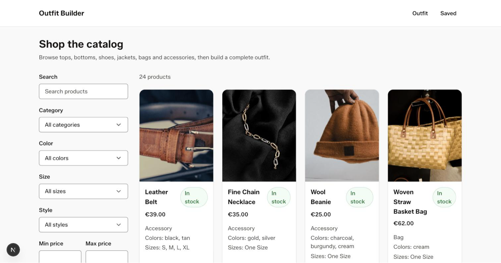
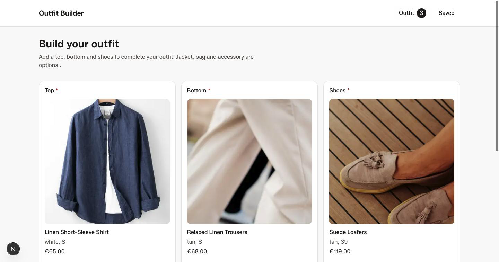
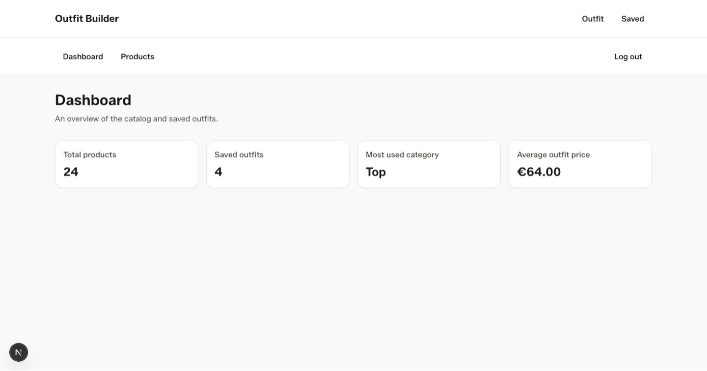

# Outfit Builder & Style Dashboard

A full-stack e-commerce case study: a product catalog, an interactive outfit builder, an admin dashboard, and an experimental AI-powered virtual try-on integration — built to demonstrate production-oriented engineering practice (shared core contracts, server-side validation, automated tests and CI gates), not just a working demo.

## Overview

The Outfit Builder helps users combine products across different categories, colors, sizes, and styles.

Selected items are displayed in a live preview, while compatibility rules and automatic price calculation support the outfit-building process.

The project also includes an admin dashboard for managing products and viewing catalog statistics.

## Screenshots

| Catalog | Outfit builder | Admin dashboard |
| --- | --- | --- |
|  |  |  |

Product photography is sourced from [Unsplash](https://unsplash.com) (Unsplash License, free to use). Product image URLs are restricted server-side to a fixed set of allowed hosts (`packages/contracts/src/domain/image-hosts.ts`) — the same list `next/image` is configured to load from.

## Features

- Product catalog with filtering and pagination
- Interactive outfit builder with live preview
- Product compatibility rules
- Category, color, size, and style filtering
- Automatic price calculation
- Saved outfits
- AI-powered virtual try-on integration
- Admin authentication
- Product management dashboard
- REST and GraphQL APIs
- Responsive and accessible user interface
- Automated unit, component, integration, and end-to-end tests

## Tech Stack

### Frontend

- Next.js
- React
- TypeScript
- Tailwind CSS
- Radix UI
- Zustand
- Zod

### Backend

- Node.js
- Express
- GraphQL Yoga
- PostgreSQL
- Prisma

### Testing and Infrastructure

- Vitest
- Playwright
- Docker
- GitHub Actions
- pnpm workspaces

## Architecture

The project is organized as a monorepo with separate frontend, API, and shared packages.

```text
apps/
├── web/          Next.js frontend
└── api/          REST and GraphQL API

packages/
├── ui/           Shared UI components
├── contracts/    Shared schemas, types, and business logic
└── config/       Shared development configuration
```

Next.js Server Components handle server-side catalog and outfit data.

Interactive features such as product selection, outfit management, and admin actions are implemented through focused client components.

Shared Zod schemas (`packages/contracts`) provide a common source of truth for core request validation and business-domain types — the same schema that validates an incoming `POST /api/outfits` body also defines the outfit's TypeScript type on the frontend. Coverage isn't total: read-side response shapes with nested data (e.g. a saved outfit's items with their product details) are currently retyped by hand in `apps/web`, rather than derived from a shared schema, so those specific types can still drift from what the API actually returns.

The public product catalog is read-heavy, filterable, and has no side effects, which is what GraphQL is good at — a single flexible `products` query replaces what would otherwise be several bespoke REST endpoints for filtering/sorting/pagination combinations. Outfit and admin actions (save, delete, create/update a product, log in) are mutations with real server-side side effects and their own rate limits, which map more directly onto individual REST routes than onto a GraphQL mutation schema.

## Getting Started

### Requirements

- Node.js
- pnpm
- Docker

### Installation

Clone the repository and install the dependencies:

```bash
git clone https://github.com/Bogbra/outfit-builder.git
cd outfit-builder
pnpm install
```

Build the shared `@outfit-builder/contracts` package — both `apps/api` and `apps/web` import it as a compiled package, not as raw TypeScript, so it has to exist before `pnpm dev`/`pnpm dev:api` can resolve it:

```bash
pnpm --filter contracts build
```

Create the local environment files:

```bash
cp apps/api/.env.example apps/api/.env
cp apps/web/.env.example apps/web/.env.local
```

`apps/api/.env.example` ships with a working (but published, not secret) `AUTH_SECRET` and a bcrypt hash for the example password `changeme-admin-password`, so the app boots and the admin login works out of the box. For anything beyond casual local testing, generate your own values instead of using the shipped ones:

```bash
# AUTH_SECRET — must be at least 32 characters, set to the same value in
# both apps/api/.env and apps/web/.env.local
openssl rand -base64 32

# ADMIN_PASSWORD_HASH — bcrypt hash of your own admin password. Run from
# apps/api specifically (or via pnpm --filter api exec as below) — bcryptjs
# is only a dependency of apps/api, so plain `node -e` from the repo root
# can't resolve it.
pnpm --filter api exec node -e "console.log(require('bcryptjs').hashSync('your-password', 10))"
```

Start PostgreSQL:

```bash
docker compose up -d postgres
```

Run the database migrations and seed the database:

```bash
pnpm --filter api exec prisma migrate dev
pnpm --filter api db:seed
```

Start the frontend:

```bash
pnpm dev
```

Start the API in a separate terminal:

```bash
pnpm dev:api
```

The applications are available at:

```text
Frontend: http://localhost:3000
API:      http://localhost:8080
```

## Available Scripts

```bash
pnpm lint
pnpm typecheck
pnpm test
pnpm build
```

Run the Playwright end-to-end tests:

```bash
pnpm --filter web test:e2e
```

## API Documentation

The REST surface of `apps/api` is documented as an OpenAPI 3.0 spec at [`docs/openapi.yaml`](docs/openapi.yaml). Request and response schemas are generated from the shared Zod definitions in `packages/contracts` (`pnpm --filter api generate:openapi`, checked against the committed file in CI), while which routes get documented is maintained by hand in `apps/api/scripts/generate-openapi.ts` — a new Express route doesn't automatically appear in the spec until it's registered there. Open the spec in [Swagger Editor](https://editor.swagger.io) or any OpenAPI-compatible viewer to browse it interactively. The public product catalog is served over GraphQL instead (`POST /graphql`).

## Testing

The project includes:

- Unit tests for shared business logic
- Component tests for interactive UI elements
- API integration tests
- Authentication and authorization tests
- Product and outfit workflow tests
- Playwright end-to-end smoke tests

External virtual try-on requests are mocked during automated testing to avoid non-deterministic results and third-party API costs. This validates the request/response workflow (chaining steps, status transitions, error handling) — it says nothing about the visual quality, product likeness, or identity-preservation of what fashn.ai actually generates, which isn't evaluated anywhere in this repository.

Virtual try-on sends the uploaded photo to fashn.ai, a third-party image-generation service. The application does not persist the original uploaded photo. Try-on requests stop being accessible through the application after one hour, which is this application's own local expiry — it doesn't delete or expire fashn.ai's copy of the result, which per fashn.ai's documentation is separately retained on their CDN for up to 3 days. Provider-side processing and retention are otherwise controlled by fashn.ai and are outside the scope of this repository. The feature is experimental and offers no fit guarantee.

No `FASHN_API_KEY` ships with this repository, and the try-on feature is disabled by default as a result — `POST /api/try-on` returns `503` without ever calling fashn.ai. Real provider calls, and their real per-call cost, only happen if a key is explicitly configured.

## Security

The application includes:

- Server-side input validation
- JWT-based admin authentication
- Revocable admin sessions
- Rate limiting
- Security headers
- GraphQL query restrictions
- Environment-based secret management
- Protected admin routes

## Current Scope

This repository is a portfolio project and is not currently deployed as a commercial application.

Publishing the source code publicly and running a live deployment are different things with different security requirements. Making this repository public is safe: no real secrets are committed (see `.env.example` for the placeholders), and the checks in CI include a secret scanner. Running a live, publicly reachable deployment with a real `FASHN_API_KEY` is a separate decision — see "Known limitations" and "Production Alternatives" below for what that would additionally require.

The current implementation includes:

- A single admin account
- EUR as the supported currency
- Curated stock photography
- IP-based rate limiting for virtual try-on requests

User registration, multi-user roles, and public outfit-sharing links are outside the current project scope.

Known limitations, relevant if this were ever deployed publicly rather than run locally:

- Saved outfits are shared demo data: they are not associated with individual users or browser sessions, and any client can list or delete any outfit. There is currently no ownership or access control on the public outfit endpoints.
- Polling a try-on request (`GET /api/try-on/:id`) can itself advance the try-on chain to its next (paid) step. Two near-simultaneous polling requests can trigger duplicate paid provider calls and produce a last-write-wins database update. A public multi-user deployment would require atomic state transitions or idempotent job handling.

## Production Alternatives

This is a portfolio project, not a production deployment, and the choices below reflect that scope deliberately rather than by oversight. For a real multi-tenant, publicly-deployed version, the changes that would actually matter:

- **Outfit/try-on ownership** — anonymous owner tokens or signed session cookies instead of the current global, unowned demo data (see "Known limitations" above).
- **Try-on progression** — a real background job queue (e.g. BullMQ) driving the fashn.ai chain, instead of the current client-polling-drives-progress design where `GET /api/try-on/:id` can itself trigger the next paid provider call.
- **Rate limiting behind a load balancer/reverse proxy** — `express`'s `trust proxy` setting needs to match the actual hosting topology (Cloud Run, a CDN, etc.), or the rate limiter ends up keying off the proxy's IP instead of the real client's. The current limiter also keeps its counters in memory per process; horizontal scaling would need a shared store (e.g. Redis) instead, or each instance enforces its own independent budget.
- **Scheduled cleanup** — `apps/api/scripts/cleanup-expired.ts` already deletes expired `TryOnRequest`/`AdminSession` rows, but nothing invokes it; production needs it wired to a real scheduler (Cloud Scheduler + Cloud Run Job, a cron entry, etc.).
- **Multi-currency and multi-region pricing** — prices are stored as integer minor units in a single currency (EUR) per product; genuine multi-currency support would need per-region price lists, not just formatting.

This project intentionally does not have full user accounts, Kubernetes, Terraform, Redis, or a payment/checkout system — none of that would demonstrate anything additional for its purpose here, and adding it would be scope creep, not depth.

## License

This repository has no `LICENSE` file and is not licensed for reuse, redistribution, or derivative works. It is published for portfolio and application review only. All rights reserved.